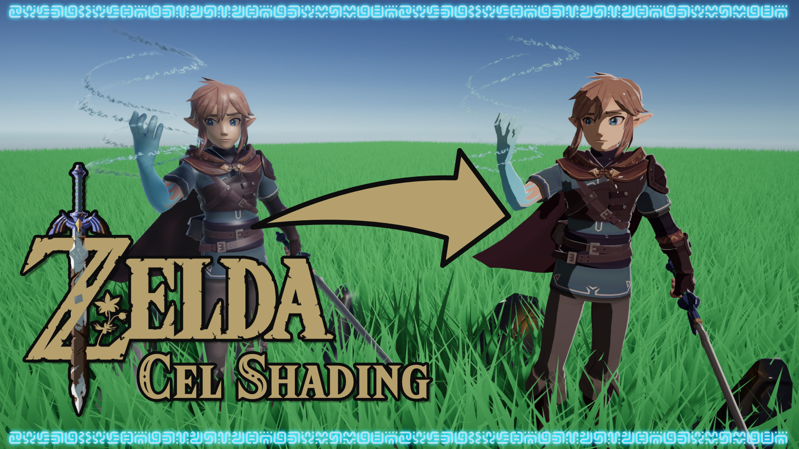

# Breath of the Wild Cel Shading in Unity Shader Graph

A recreation of the cel-shading art style found in games such as *Zelda: Breath of the Wild*.

## Overview

A cel-shaded aesthetic can help make your game visually distinct from other styles like photorealism. This effect uses Shader Graph with some custom lighting code to tweak Unity's lighting so that it appears cel-shaded.

## Software

This project was created using Unity 2020.2.1f1 and Universal Render Pipeline 10.2.2.

## Authors

This project and the corresponding tutorial was created by Daniel Ilett.

### Other Creators

This effect is based on work by others. Check them out for more information!

- [Alex Lindman's custom lighting blog post](https://blog.unity.com/technology/custom-lighting-in-shader-graph-expanding-your-graphs-in-2019)
- [Artstoff Link model](https://sketchfab.com/3d-models/link-breath-of-the-wild-8fb09ce90277471ca51c83b95c916b33)
- [Bui Tuong Phong's shading model](https://en.wikipedia.org/wiki/Phong_shading)

## Release

This project was released publicly on July 12th 2021 alongside a [YouTube tutorial](https://www.youtube.com/watch?v=lUmRJRrZfGc) outlining the steps taken to make the effect.
